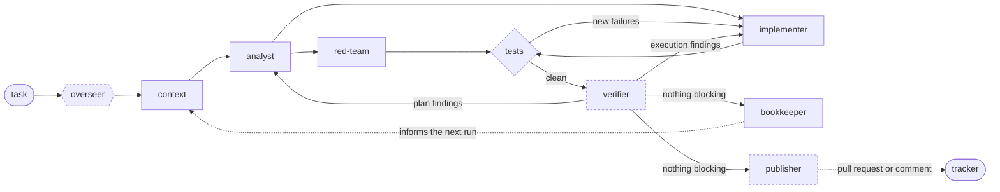

# Ratatoskr

An orchestrator for [rag-rat]-driven coding runs. A run is a graph of agent nodes that gather what
the repository already knows, analyse the impact, red-team the baseline, implement the change in an
isolated worktree, and iterate until the tests agree and the diff survives review — checkpointing
every step to a local SQLite store.

The point is the last node. On a finished run the **bookkeeper** writes what was learned back into
rag-rat's memory, so the *next* run's context node surfaces it while planning. Runs compound instead
of starting from zero.



Dashed nodes are opt-in: each runs only when it has a model route. Without them a run goes straight
to the built-in workflow and converges on its test result alone.

## How a run works

1. **overseer** picks which workflow runs the task, when the repo defines more than one, and records
   why.
2. **context** gathers what the repository already knows: the tracker papertrail, the code, and
   rag-rat's own memories. It hands the analyst a distillation — what bears on this task and what
   constrains it — alongside those memories unmodified, so the interpretation can be checked against
   its source.
3. **analyst** determines the blast radius, the requirements the change must satisfy, and the
   acceptance steps that prove it done.
4. **red-team ∥ implementer** run concurrently: red-team characterises the *baseline* acceptance run
   in a sandbox, while the implementer edits a fresh git worktree — reading, writing and running its
   checks with this pipeline's own tools.
5. **converge** re-runs the implementer until the change introduces no new failures. An iteration
   that edited the tests or their runner is refused outright — a gate that can be satisfied by
   editing itself is not one.
6. **verifier** reads the diff against the requirements once the tests are clean, and answers what
   the tests cannot. Findings that fault the *plan* go back to the analyst; the rest go back to the
   implementer.
7. **bookkeeper** distils what the run learned — weighted toward what it *struggled* with — and
   writes it to rag-rat via `memory_create`. Alongside it, **publisher** delivers what the run
   *made*: a pull request, a comment on the issue it was given, both, or neither. One writes to the
   memory graph and the other to the tracker, so they run concurrently.

Converge only believes a test run the change did not referee. An iteration that touches the tests,
their runner config (`conftest.py`, `pytest.ini`, `jest.config.*`, `Cargo.toml`, `package.json`, …)
or a file the runner auto-loads is sent back to revert it, named file by name — passing by editing
what decides passing is the one shortcut the gate exists to refuse. A task that is *meant* to change
tests says so before the work starts, in the ruleset:

```ts
// .ratatoskr/rules/_defaults.ts
defineDefaults({ mayModifyTests: ["crates/foo/tests"] });
```

A repo can define its own workflows in `.ratatoskr/workflows/*.ts`, each declaring what it is for:

```ts
// .ratatoskr/workflows/research.ts
defineWorkflow({
  name: "research",
  purpose: "Answer a question about the repository without changing it.",
  whenToUse: ["the task asks what or why", "no code change is expected"],
});
async function plan(input) { /* compose the node bindings */ }
```

A workflow that introduces a node of its own lists it in `nodes`, so `.ratatoskr/rules/<node>.ts`
is accepted rather than rejected as targeting something that does not exist. A node's preamble is
replaced per workflow through the ruleset that already governs it — inline for a short one, or from
a file beside the ruleset when it is long enough that a TS string literal stops being editable:

```ts
// .ratatoskr/rules/analyst.ts
defineAgent("analyst", { systemPromptFile: "research-analyst.md" });
```

With one defined it is used; with several, name one with `--workflow <name>` — or set a
`[models.overseer]` route and one is chosen per task from the declared purposes and cases, with the
choice and its reasoning checkpointed. Without either, a repo with several workflows is asked to
name one rather than guessed at: choosing the alphabetically-first would look like a decision while
being an accident. With none, the built-in flow above runs. A single `.ratatoskr/workflow.ts` still
works and is registered under its filename.

Every node's output is validated against its JSON Schema and checkpointed before the next node
runs, so a failure stops the run with `status = failed` attributed to the node that failed, and the
work up to that point is inspectable.

A node that gets stuck can **ask a peer** mid-run: the `ask` tool routes a question to another node
(the analyst answers anything unrouteable) and hands the answer back as the tool result, without
unwinding the asking node.

## Quickstart

Requires a repository already indexed by rag-rat, and `bwrap` for the default sandbox.

```sh
cargo build --workspace
cargo run -p ratatoskr-cli -- init          # writes ratatoskr.toml
export ANTHROPIC_API_KEY=...                # or MOONSHOT_API_KEY, per [models.*]
cargo run -p ratatoskr-cli -- run "Fix the flaky retry in the store"
```

`ratatoskr.toml` is gitignored; `ratatoskr.toml.example` is the committed template.

If the models are reached through something local rather than the provider directly, see
`[endpoint]` in that template. A gateway that adapts requests per client has to be told which
client this is — an unrecognised one gets whatever default its author chose for somebody else, and
for a tool-calling run that usually means the conversation is rebuilt on every turn rather than
read back from cache.

## Commands

| Command | What it does |
|---|---|
| `init` | Write a default `ratatoskr.toml`. |
| `ask <question>` | One agent answers a question about the repo, grounded in rag-rat's tools. |
| `plan <issue>` | context → analyst, printing a grounded plan. No code is changed. |
| `run <issue>` | Everything `plan` does, then fork, converge, and bookkeep. |
| `bookkeep <run-id>` | Replay just the bookkeeper against a stored run — no re-run. |
| `status <run-id>` | A run's status and every per-node checkpoint. Pure read: no rag-rat, no LLM. |
| `workflows` | List the workflows a run can be given, and what each is for. |
| `serve` | The observability dashboard (see below). |
| `clean` | Reclaim per-run worktrees and their `ratatoskr/*` branches. |

`plan` and `run` take the issue as an argument or `--file <path>` for long text, and `--json` for
the raw `RunState` instead of a summary. `clean` lists what it would remove unless given `--force`,
because removal discards each worktree's uncommitted changes.

## Dashboard

```sh
cargo run -p ratatoskr-cli -- serve          # http://127.0.0.1:7878
```

Watch runs as they happen: the pipeline graph with each node's state, the converge loop and its
iteration count, and every checkpoint's output. Runs can also be started from the browser.

It reads the same SQLite file a run writes to and never writes to it, so it is safe to leave open
against a live run. Runs started from the dashboard are spawned as child processes with an explicit
working directory, and are capped at one at a time by default (`--max-runs`).

A node that gets stuck can ask *you*: when you are watching a run, a question addressed to the user
appears in the dashboard and your answer goes back as that tool's result. Nobody watching, or nobody
answering in time, and the analyst answers instead — exactly as an unattended run behaves.

One dashboard can watch several projects. Each keeps its own store, worktrees, and logs; nothing is
merged, and a project switcher appears once there is more than one:

```sh
cargo run -p ratatoskr-cli -- serve --project ~/src/one --project ~/src/two
```

### Hosting it

Loopback — the default — needs no accounts: whoever can reach the port already owns the checkout.
An instance other people can reach is different, because the dashboard can start runs, and a run
drives a coding CLI against the repository and spends API credits.

Two things are gated. **Acting** — starting a run, answering a node's clarification — always needs
an `operator` session, on every project. **Reading** needs a session too, unless the project was
named with `--public`.

```sh
RATATOSKR_PASSWORD='...' ratatoskr users add kk --role operator
ratatoskr serve --addr 0.0.0.0:7878 --public ratatoskr --secure-cookies
```

The password comes from the environment, never an argument: an argument is visible to every process
on the machine through `ps` and is written to your shell history.

`--public` means genuinely public. Everything a run recorded is then readable by anyone: the issue
text, the model's output, and the contents of every file its tools read. A private project is
hidden rather than refused — a stranger gets the same answer for "private" as for "no such
project", so the list of repositories this machine works on stays private too.

Put TLS in front of it and pass `--secure-cookies`, which marks the session cookie `Secure` and
gives it the `__Host-` prefix. Leave it off for loopback: a browser discards a `Secure` cookie sent
over plain http, and sign-in then fails in a way that looks like a wrong password.

The endpoint a run process calls to ask a human a question is not on that listener at all. It binds
loopback separately (`--internal-addr`), so it is unreachable from outside by construction rather
than by a rule that has to keep being enforced.

| | reads a public project | reads a private one | starts runs, answers questions | manages accounts |
|---|---|---|---|---|
| nobody | yes | | | |
| `viewer` | yes | yes | | |
| `operator` | yes | yes | yes | |
| `admin` | yes | yes | yes | yes |

`ratatoskr users list`, `role`, `passwd`, `disable` and `enable` manage accounts. A role change or a
disable reaches an open browser on its next request — neither waits for the session to lapse.

### Starting a run from GitHub

Mention the bot in an issue and it starts a run on that repository:

> `/ratatoskr` the retry test flakes on CI, please fix it

```sh
ratatoskr users link-github kk 1234        # GitHub's numeric user id, not a login
RATATOSKR_GITHUB_WEBHOOK_SECRET='...' ratatoskr serve --github-bot ratatoskr ...
```

Point a repository webhook at `/api/integrations/github`, sending **issue comments**, with that
same secret.

Either `/ratatoskr …` or `@ratatoskr …` triggers it, and the difference is who gets notified. The
trigger is matched as text — nothing resolves it against GitHub — so `/` collides with no username
and notifies nobody, which is what you want unless the handle is an account you actually own.
Mentioning one you do not own notifies a stranger every time somebody starts a run.

An App is mentioned as `@name[bot]`, which is what GitHub's autocomplete inserts, and that form is
accepted — the suffix is treated as part of the address rather than the start of the instruction.

If the bot has its own GitHub account, name it with `--github-account`, with or without the
`[bot]`. It is only needed when that
login differs from the trigger word, which it usually does — the word people want to type is rarely
the name still available on GitHub. It is what stops the bot reading its own comments as new
instructions once it starts posting; a GitHub App's `[bot]` suffix is handled.

Being able to comment is not being able to run anything. The person who mentioned the bot has to
map to an operator here — that is what `link-github` establishes — and everyone else is ignored.
The link is keyed on GitHub's numeric user id rather than a login, because a login can be changed
and then handed to somebody else, and an identity keyed on the name would follow the name rather
than the person.

Which project a mention is about is read from each project's `origin`, so there is no mapping to
keep in step; a project whose origin is not a GitHub repository simply cannot be addressed this
way.

The signature is the only thing that makes a delivery trustworthy. The endpoint is public by
necessity, so every field in the body — including who GitHub says sent it — is attacker-controlled
until the HMAC checks out. An unsigned delivery is refused; a correctly signed one that is not for
us is answered `200` and logged, because GitHub retries anything else and there is nothing to retry
about a comment that was not addressed to the bot.

The UI is a separate build artifact and is optional: without it you still get the JSON API
(`/api/runs`, `/api/runs/{id}`, `/api/runs/{id}/nodes/{node}`).

```sh
cd crates/ratatoskr-serve/web && bun install && bun run build
```

See the [web README](crates/ratatoskr-serve/web/README.md) for the dev-server workflow.

## Configuration

`ratatoskr.toml` covers model routing per node, how rag-rat's MCP server is launched, the sandbox
backend and test command, and the implementer's CLI and iteration budget. It is validated on load,
so a bad backend or an empty test command fails immediately rather than deep inside a run.

The sandbox backend is `landlock` (bubblewrap + Landlock — the default; no image, builds offline)
or `microsandbox` (a MicroVM, needs KVM). microsandbox sits behind a Cargo feature because its
build script downloads a helper binary, which fails in the network-less test sandbox; enable it
with `cargo build --features ratatoskr-exec/microsandbox`.

### Agent rulesets

`.ratatoskr/rules/<node>.ts` governs one node. A ruleset is authoritative where it speaks — a node
that declares a `model` needs no `[models.<node>]` entry at all, and that TOML entry becomes the
fallback:

```ts
defineAgent("context", {
  model: { provider: "moonshot", model: "kimi-k2.5" },
  systemPrompt: "You gather what the repo knows...",  // replaces the node's built-in preamble
  tools: { allow: ["semantic_search"] },    // REPLACES the default tool set; `deny` also supported
  maxTurns: 40,
  onToolCall({ tool }) {                    // per-call gate, consulted for every tool call
    return tool === "papertrail_issue_search" ? "deny" : "allow";
  },
});
```

Rulesets apply to every node that is an LLM agent — `context`, `analyst`, `redteam`, `implementer`,
`verifier`, `bookkeeper`, `overseer`, `publisher`, `characterizer`.
TypeScript is transpiled and evaluated in-process; the types are for editor ergonomics and are
stripped at load.

### Agent plugins

`.ratatoskr/plugins/` (and any path in `[plugins] paths`) holds plugins in the format coding CLIs
already use — a `.claude-plugin/plugin.json` manifest and an optional `hooks/hooks.json`. A
plugin's `SessionStart` hook runs once per run and its output is prefixed to each node's preamble,
so a node can open with the repository's shape instead of discovering it one tool call at a time.

A path may name a plugin or a directory of them. A coding CLI's plugin cache keeps every version
it has installed, so naming the plugin rather than one version is the right thing to configure:
the copy that host records as installed is the one that loads, and a plugin is never loaded twice
under one name.

Nothing a plugin *does* can fail a run: one that is missing, malformed, slow, or broken is logged
and skipped, and the node simply gets less context. Naming a plugin that isn't installed is
different — that is a typo, and it fails the run rather than silently binding less than you asked
for.

Hooks are read from `hooks/hooks.json` and from whatever the manifest's `hooks` key names, which
adds to it rather than replacing it; `mcpServers` works the same way alongside `.mcp.json`. Both
keys take a path, an inline block, or an array of either. A hook's `matcher` follows the format's
three rules — absent, empty or `*` matches everything; a value of only letters, digits, `_`, `-`,
spaces, `,` and `|` is an exact name or list of them; anything else is an unanchored regex — so
`Write|Edit` matches those two tools and not `NotebookEdit`. `SessionStart`'s matcher is read
against the session source, which here is always `startup`.

A hook runs under `bash` (or its declared `shell`), or directly with no shell when it declares
`args`. It is given `CLAUDE_PLUGIN_ROOT`, `CLAUDE_PROJECT_DIR`, and a `CLAUDE_PLUGIN_DATA` under
`.ratatoskr/plugin-data/<plugin>/` — and *only* those: any `CLAUDE_*` in the surrounding
environment is cleared first, so a run started from a coding CLI cannot hand a plugin that host's
state as its own. Its output is read only when it exits 0.

Installing a plugin is enough to use it: with no declaration anywhere, every discovered plugin
applies to every node. Rulesets *narrow* that, in the same place they govern a node's model and
tools:

```ts
// .ratatoskr/rules/_defaults.ts — every node inherits this
defineDefaults({ plugins: ["rag-rat"] });

// .ratatoskr/rules/analyst.ts — adjust what this one inherits
defineAgent("analyst", { plugins: { add: ["impact-lens"], remove: ["noisy"] } });

// or start from nothing, said out loud
defineAgent("context", { plugins: { inherit: false, add: ["context-only"] } });

// or name the set exactly
defineAgent("bookkeeper", { plugins: ["rag-rat"] });
```

A worked example — giving two nodes a behavioural plugin without giving it to the rest. `ponytail`
pushes for the shortest solution that works, which is what you want from the node writing code and
not from the one transcribing test output:

```toml
# ratatoskr.toml — `~` is expanded, and a path names the plugin rather than one of its versions:
# a coding CLI's cache keeps every version it has installed, and the installed one is what loads.
[plugins]
paths = [
  "~/.claude/plugins/cache/rag-rat/rag-rat",
  "~/.claude/plugins/cache/ponytail/ponytail",
]
```

```ts
// .ratatoskr/rules/plugins.ts
defineDefaults({ plugins: ["rag-rat"] });                    // the repository-wide set
defineAgent("analyst", { plugins: { add: ["ponytail"] } });  // these two also get the mode
defineAgent("implementer", { plugins: { add: ["ponytail"] } });
```

Note what reaches the node. A plugin's *skills* arrive as a `Skill` tool the node may call, so a
skill applies only if the node decides to ask for it. A plugin's `SessionStart` hook output is
prefixed to the node's preamble, so it applies to everything that node does. A behavioural plugin
wants the second, which is why binding it is enough — there is nothing to invoke.

Hooks still run once per run whichever way you bind them — each node composes its context from the
plugins it holds, so per-node binding costs nothing extra.

A plugin can also bring **tools**. Any stdio MCP server it declares (`mcpServers` in the manifest,
or a `.mcp.json` beside it) is connected once per run and offered to every node that binds the
plugin, alongside rag-rat's own catalogue. A node that names no tools of its own gets them for
free — binding the plugin is the statement. A node whose ruleset spells out `tools.allow` is a
different case: that list is exhaustive, so it must name the plugin's tools too (the run warns
when it doesn't). `deny` removes any of them, and an `onToolCall` gate sees them under the same
names.

A plugin server's tools are named the way the format names them —
`mcp__plugin_<plugin>_<server>__<tool>` — so a hook matcher or permission rule written for that
host matches here too. rag-rat is the *user-configured* case and keeps its plain names, because
every node's built-in tool list, every ruleset and every recorded memory calls it `semantic_search`
rather than a qualified spelling of it. That name is the same string end to end: what the model
calls, what `tools.allow`/`deny` and an `onToolCall` gate match, and what a hook matcher sees.

Where two servers still offer one name, the first one connected keeps it, and the collision is
logged with both server names. A server that will not start costs its plugin's tools and nothing
else.

Planning nodes carry three built-in tools — **`Read`, `Grep` and `Glob`** — under those names and
with those argument shapes, because that is what a plugin matches on and inspects. They are
offered before a ruleset narrows, so `tools.deny` removes them like anything else.

Read-only, deliberately. **`Write`, `Edit` and `Bash`** are the implementer's, and only its: a
planning node that could edit the checkout it is reasoning about would undo that separation for
nothing. Its file tools are rooted at its own worktree rather than the checkout, and every `Bash`
command runs in the same sandbox its acceptance checks run in — no network, and nothing outside the
worktree is writable. Paths outside the root are refused, `Read` clips long lines and refuses
binaries, and a search skips `.git`, `target`, `node_modules`, `.venv`, `dist` and dot-directories.

The implementer is driven here, with these tools, rather than by handing the task to a coding CLI.
A CLI is built around a human who is watching: it decides for itself what it may run, asks when it
is unsure, and reports progress to a terminal. A run has nobody to answer, so a question is a
stopped node. Driving the model directly is also what puts every command inside the run's own
sandbox and every model turn on its ledger.

A plugin's hooks fire at the points a run actually has:

| Event | Fires | Matcher is read against | Where its context lands |
|---|---|---|---|
| `SessionStart` | once, per run | the source, always `startup` | each node's preamble |
| `SubagentStart` | a node begins | the node name | that node's preamble |
| `UserPromptSubmit` | a node is prompted | *(the format gives it none)* | alongside the prompt |
| `PreToolUse` / `PostToolUse` | around each tool call | the tool name | the tool's result |
| `Stop` / `StopFailure` | a node's turn ends, or fails | *(the format gives them none)* | nowhere — see below |
| `SubagentStop` | a node finishes, either way | the node name | nowhere — see below |
| `SessionEnd` | once, when the run ends | the run's final status | nowhere — see below |

`Stop`, `StopFailure`, `SubagentStop` and `SessionEnd` run for what they *do* — recording, notifying, syncing.
There is no conversation left to add to by then, and a node's answer goes straight to a schema, so
context returned there is reported as unused rather than quietly dropped.

Every other event in the format — `PreCompact`, `PermissionRequest`, `Notification`,
`MessageDisplay`, the worktree pair and the rest — describes a session with a person in it, or a
lifecycle this host does not have. A plugin registering only those contributes nothing here.

An event's matching hooks run **together**, and their answers are joined in plugin order so the
result does not depend on how the timings fall. Each answers with the usual envelope, and only
`additionalContext` is read:

```json
{"hookSpecificOutput": {"hookEventName": "PreToolUse", "additionalContext": "…"}}
```

That text is appended to the tool result as a labelled note, which is the only place it can reach
the model. **Write facts, not instructions.** A node treats imperative text arriving through a tool
result as untrusted — correctly, since that is where prompt injection would come from — so a hook
that says "always do X" is likely to be quoted and refused, while one that says what is true about
the repository gets used. Whether a call proceeds at all is not a plugin's decision: gating belongs
to a ruleset's `onToolCall`, which is the repository speaking about its own agents.

What a plugin's hooks may spend is the format's own defaults — 600s per hook, 10,000 characters of
output — so a plugin behaves here the way its author tested it. Those are generous because that
host has a person watching a spinner; a run here is unattended, and every limit is overridable:

```toml
[plugins.hooks]
timeout_secs = 600         # a hook that declares no `timeout` of its own
max_timeout_secs = 600     # ceiling on one that does
output_budget = 10000      # characters one event's hooks may contribute
context_budget = 10000     # characters of plugin context a node carries into its preamble
tool_time_budget_secs = 0  # total seconds per run in tool-call hooks; 0 means no limit
```

`tool_time_budget_secs` has no equivalent in the format, because there a person can interrupt.
Hooks around tool calls fire on *every* call a node makes, so it is the only bound on what plugins
cost a run as a whole — set it if you want one.

Note that a plugin matching a coding CLI's tool vocabulary (`^(Grep|Read|Bash|Write|Edit)$`) fires
for the implementer, which calls exactly those, but not for a planning node — those call
`semantic_search` and `impact_surface` instead, and hooks meant for them must say so.

A plugin's **skills** are offered to the nodes that bind it. Each is a `skills/<name>/SKILL.md` (or
a bare `SKILL.md` for a plugin that is one skill) whose frontmatter says when it applies:

```markdown
---
name: dream-review
description: Use when asked to triage the memory-maintenance worklist.
---

# dream-review

Instructions the node follows once it has chosen this skill.
```

A node carries every bound skill's *description* in the schema of a synthetic `Skill` tool, and
loads the *body* of the one it picks as that tool's result — so the instructions cost nothing until
they are wanted, which is the point of a skill over a longer `systemPrompt`. The tool is named as
the format names it, and a node that binds no skills is offered no tool.

Only `name` and `description` are read. The rest of the frontmatter (`allowed-tools`, `model`,
`hooks`, `shell`) describes capabilities of a coding CLI that a node cannot honour, and is ignored
rather than half-applied. `${CLAUDE_SKILL_DIR}` in a body resolves to the skill's own directory.

### Scripted orchestration

`.ratatoskr/workflow.ts` replaces the built-in run flow outright when present, letting a repo
express its own ordering, fan-out, and gating over the same nodes. See
[`examples/workflow.ts`](examples/workflow.ts). Every safety gate stays enforced in Rust on the
bindings rather than delegated to the script.

`.ratatoskr/` otherwise holds runtime state — logs and the store — and is gitignored, except for
`rules/` and `workflow.ts`, which are version-controlled.

Per-run worktrees live outside the checkout (`[worktree] root`). Build tools find their project root
by walking up, so a worktree nested inside the repository resolves to the outer project rather than
to itself — cargo, for one, then builds into the outer `target/`, which the sandbox mounts
read-only. Ratatoskr warns when it is pointed at a nested root.

## Workspace

| Crate | Role |
|---|---|
| `ratatoskr-core` | Domain types: `RunState`, `RunStatus`, `RatatoskrConfig`, the `ToolPolicy` seam. No async runtime. |
| `ratatoskr-graph` | The `Node` trait, `NodeError`, and the `parse_validated` schema gate. |
| `ratatoskr-mcp` | rag-rat MCP client — spawns rag-rat, lists tools, hands back a cloneable sink. |
| `ratatoskr-agent` | Builds a `rig` agent bound to a model + rag-rat's tools; the per-call ruleset gate. |
| `ratatoskr-script` | TypeScript rulesets and `workflow.ts`: transpile (swc) + evaluate (rquickjs). |
| `ratatoskr-nodes` | The nodes, plus the `run_plan` / `run_full` executors and the converge loop. |
| `ratatoskr-exec` | Git worktrees and sandboxed command execution. |
| `ratatoskr-store` | SQLite checkpoint store, single-writer by construction. |
| `ratatoskr-serve` | HTTP API over the store (read-only on it), the run launcher, sessions and roles, and the dashboard UI. |
| `ratatoskr-cli` | The `ratatoskr` binary. |

## Development

```sh
cargo test --workspace
cargo clippy --workspace --all-targets -- -D warnings
cargo fmt --all -- --check
```

CI runs all three and they must be green; the workspace sets `warnings = "deny"`, so a warning
fails the build. `AGENTS.md` covers the conventions this repo expects from contributors.

> **rig note:** the agent runtime lives in `rig-agent` (split out of `rig-core` in 0.41), and its
> `.rmcp_tools()` bridge pins **`rmcp` 2.x** — so this workspace's `rmcp` is held at 2.x to match.
> A 3.x `ServerSink` would not type-check against it.

## License

MIT — see [LICENSE](LICENSE).

[rag-rat]: https://github.com/cq27-dev/rag-rat
